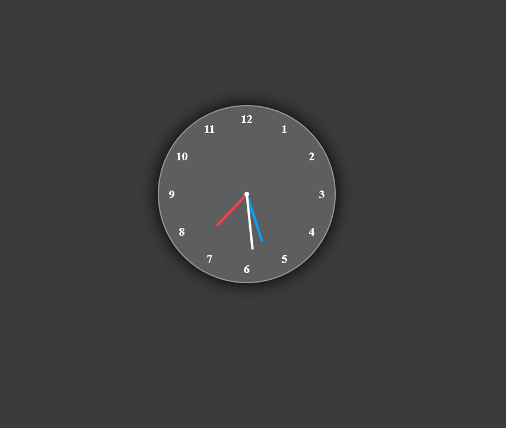

# 🕒 Analog Clock using HTML, CSS & JavaScript

A simple and responsive **Analog Clock** built using **HTML, CSS, and JavaScript**.  
The clock dynamically updates every second using JavaScript's `Date` object.

---


## 🌐 Live Demo

[View Live]((https://clockang.netlify.app/))

---

## Screenshot



---

##  Features

- Real-time clock using JavaScript
- Smooth hour, minute, and second hand rotation
- Clean and modern UI
- Pure HTML, CSS, and JavaScript (no libraries)
- Responsive centered layout

---

## Technologies Used

- **HTML5** – Structure of the clock
- **CSS3** – Styling and layout
- **JavaScript (ES6)** – Clock functionality and time updates

---

## Project Structure

```
Analog-Clock/
│
├── index.html      # Main HTML structure
├── style.css       # Clock styling
├── script.js       # Time logic and rotation
└── README.md       # Project documentation
```

---

## ⚙️ How It Works

JavaScript retrieves the current system time using the `Date()` object.

The rotation angles for the clock hands are calculated using:

- **Hour Hand**

```
30 * hours + minutes / 2
```

- **Minute Hand**

```
6 * minutes
```

- **Second Hand**

```
6 * seconds
```

The clock updates every **1 second** using:

```javascript
setInterval(displayTime, 1000);
```

---


---

⭐ If you like this project, please consider giving it a **star on GitHub**!
